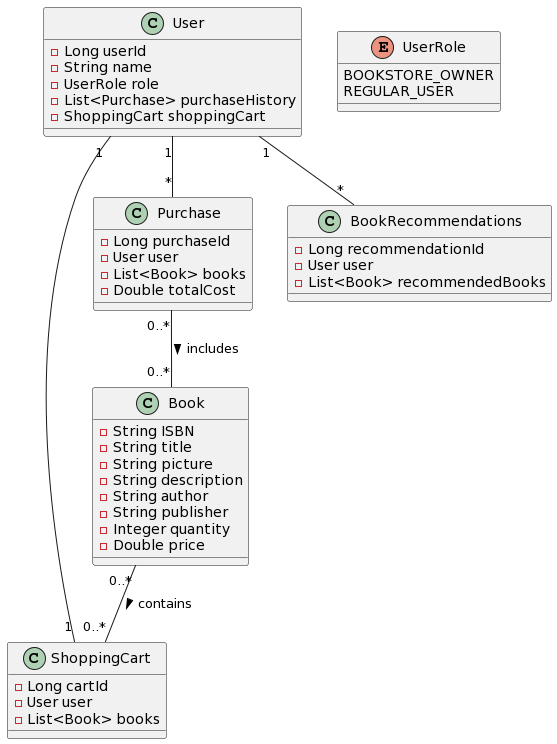
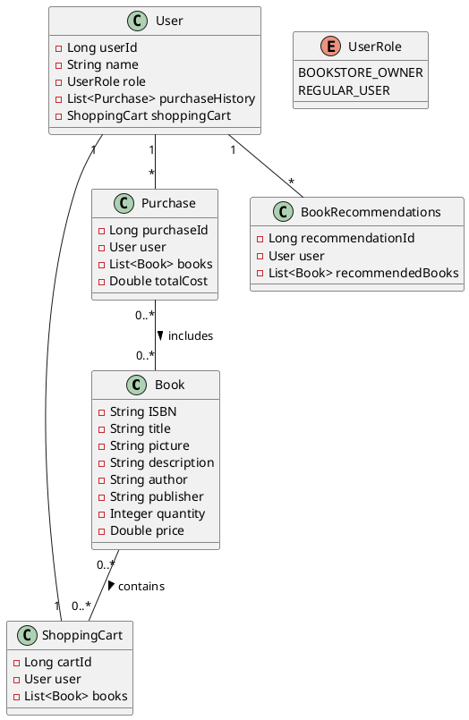
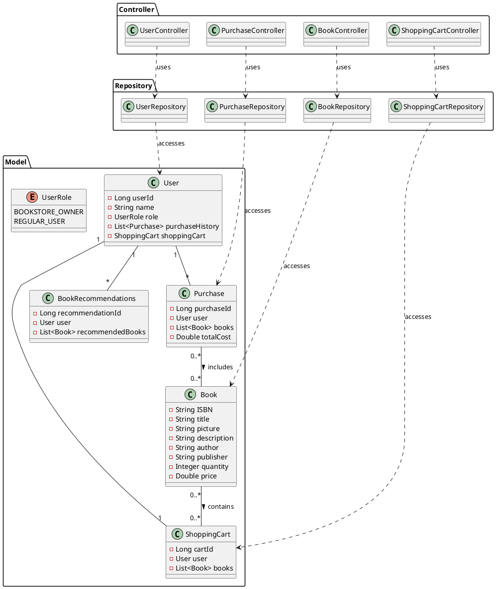

# SYSC4806_Project

Azure link: https://sysc4806-project.azurewebsites.net/

## To Access Database

1. Download DBeaver
2. Ensure these settings are in your application.properties file
```
    spring.datasource.url=jdbc:h2:mem:testdb;DB_CLOSE_DELAY=-1;DB_CLOSE_ON_EXIT=FALSE
    spring.datasource.driverClassName=org.h2.Driver
    spring.datasource.username=sa
    spring.datasource.password=
    spring.jpa.database-platform=org.hibernate.dialect.H2Dialect
    
    # Enable H2 console
    spring.h2.console.enabled=true
    spring.h2.console.path=/h2-console
    
    # H2 Server mode configuration
    spring.datasource.hikari.data-source-properties.DATABASE_TO_UPPER=false
```
3. Start the SYSC4806ProjectApplication.java
4. Use DBeaver to connect to our database
   1. Click on New Database Connection
   2. Select H2 Embedded V.2
   3. Enter Path: "mem:testdb"
   4. Enter Username: "sa"
   5. Enter Password: ""
   6. Hit Test Connection, Should see Connected 

## UML Diagrams

### Models UML
 




### Rough System Diagram



